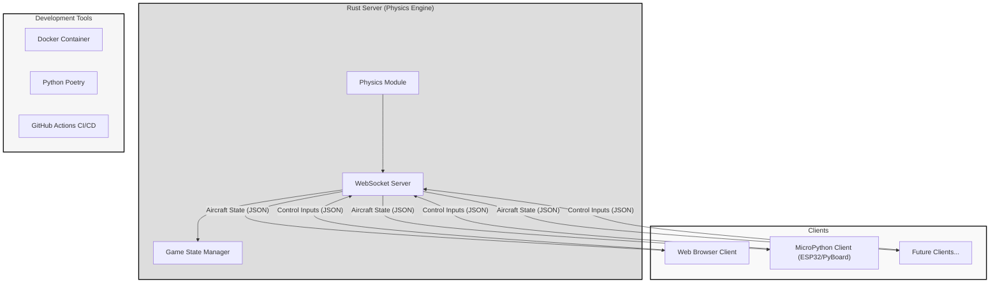
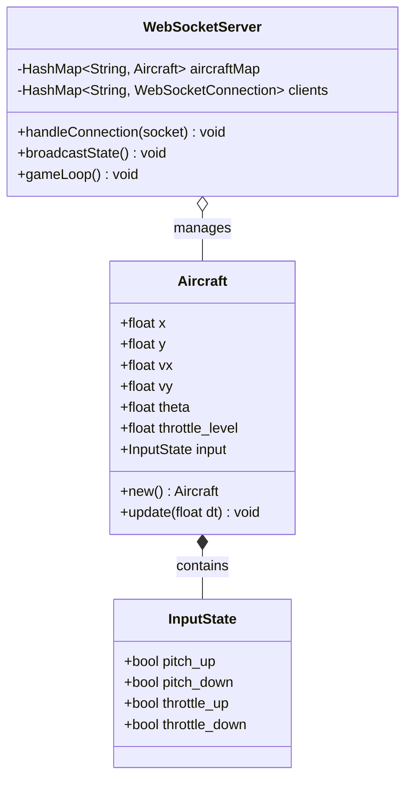
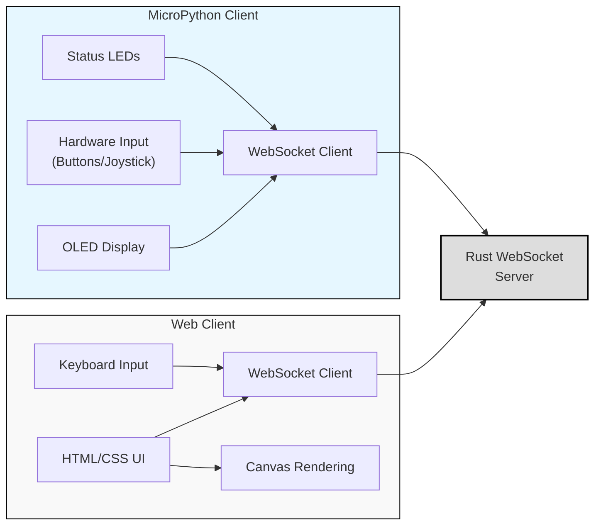
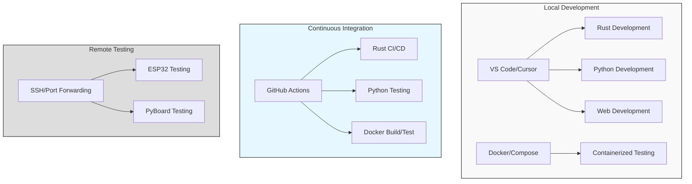
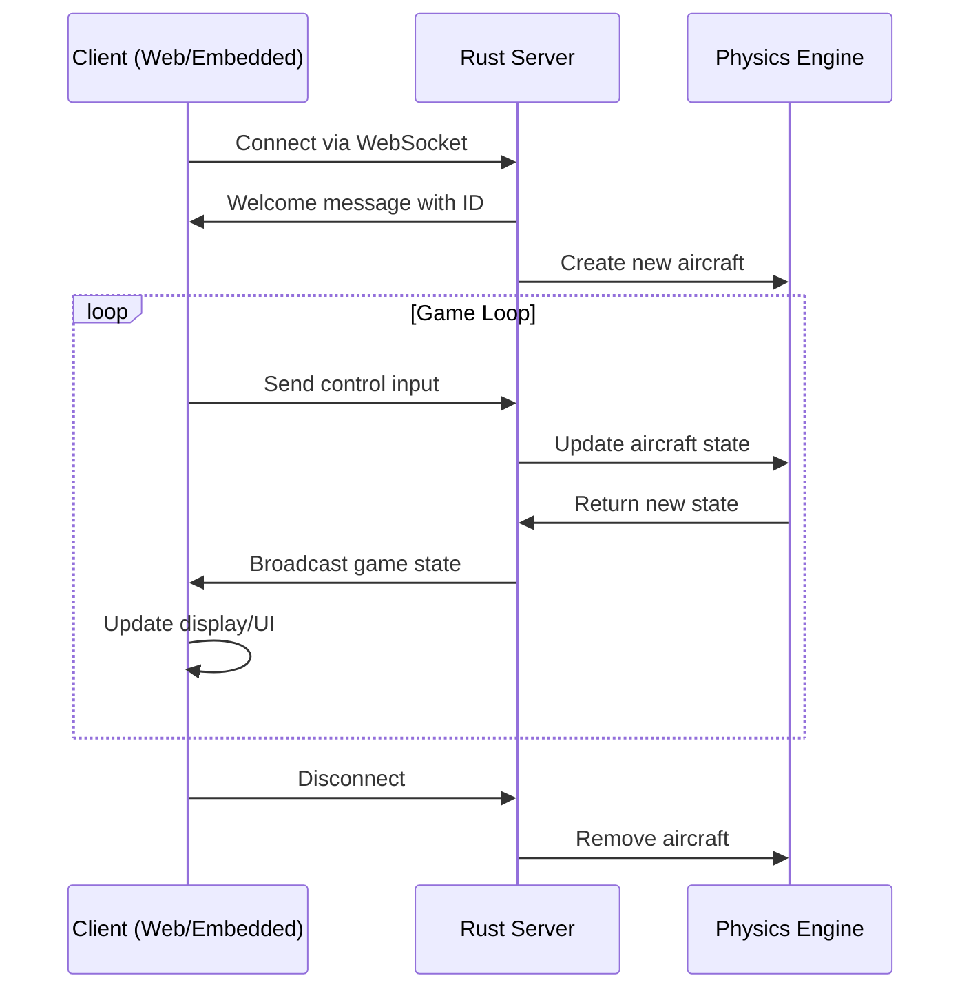

# Flight Simulator - Multi-platform Client-Server Architecture

A sophisticated flight simulator demonstrating cross-platform development skills using multiple technologies:

[](https://github.com/yourusername/flight-rs/actions/workflows/rust.yml)
[](https://github.com/yourusername/flight-rs/actions/workflows/micropython.yml)

## Architecture Overview



## Components

### Rust Server

The core of the flight simulator, implementing accurate flight physics and enabling real-time multiplayer experiences.



### Client Architecture



## Features

- Real-time flight simulation with accurate physics
- Cross-platform multiplayer capability
- Embedded device support via MicroPython
- Comprehensive testing infrastructure
- Containerized development and testing

## Development Environment



## Data Flow



## Getting Started

1. Start the Rust server: `cargo run --bin server`
2. Connect via web browser: http://localhost:8080
3. For MicroPython client, flash `micropython/client.py` to your device

### Using Docker

```bash
# Start the server
docker compose up server

# Run tests
docker compose up test

# Development environment
docker compose up dev
```

## Project Structure

```
flight-rs/
├── src/               # Rust server code
├── web/               # Web client
├── micropython/       # MicroPython client for embedded devices
│   └── lib/           # MicroPython libraries
├── python/            # Python development tools
│   ├── tests/         # pytest test suite
│   └── scripts/       # Development utilities
├── docker/            # Containerization for testing
└── .github/workflows/ # CI/CD pipelines
```

## Continuous Integration

This project uses GitHub Actions for continuous integration and testing. The workflows include:

- Building and testing the Rust server
- Linting and testing Python code
- Testing MicroPython client
- Building and testing Docker containers

## Contributing

1. Fork the repository
2. Create your feature branch: `git checkout -b feature/amazing-feature`
3. Commit your changes: `git commit -m 'Add some amazing feature'`
4. Push to the branch: `git push origin feature/amazing-feature`
5. Open a Pull Request
