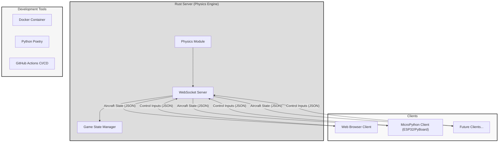
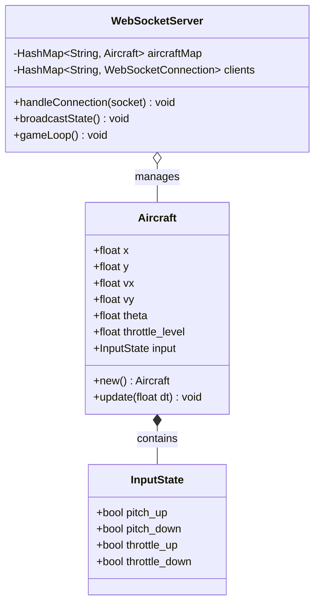
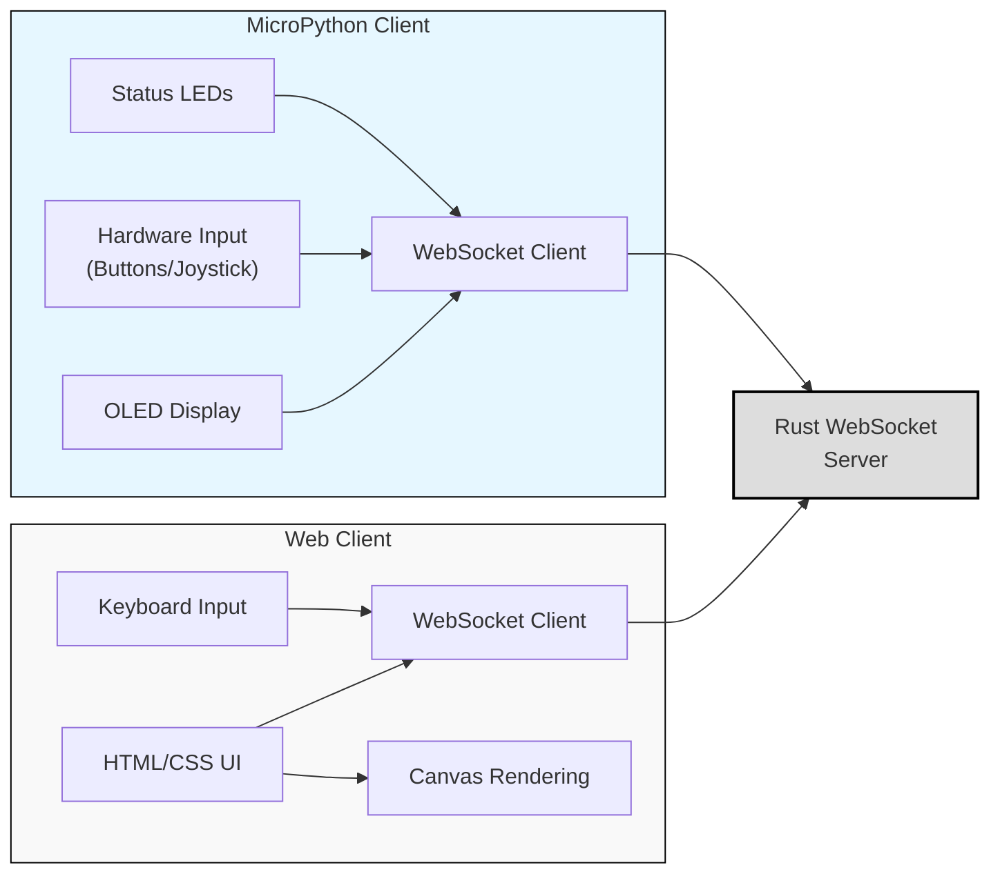
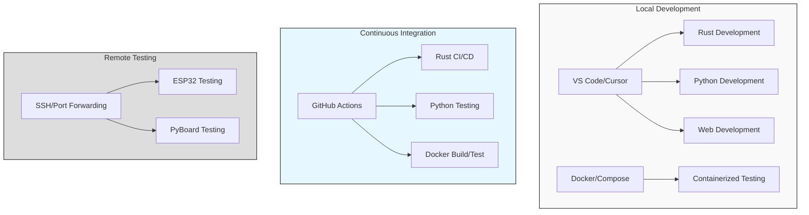
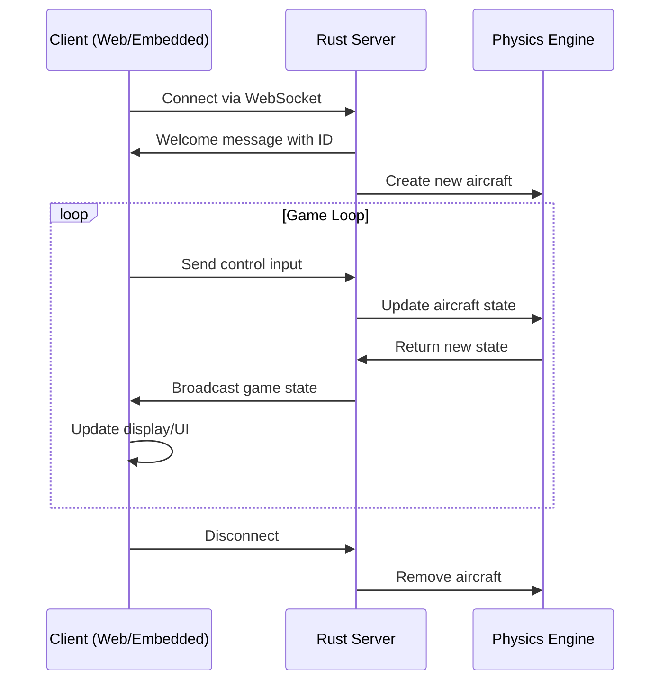
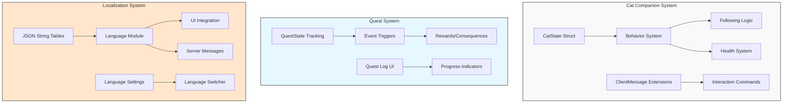
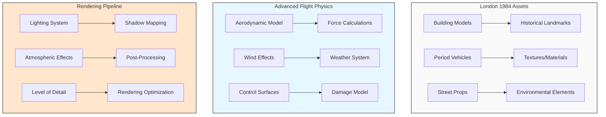

# Flight Simulator - Multi-platform Client-Server Architecture

A sophisticated flight simulator demonstrating cross-platform development skills using multiple technologies:

[](https://github.com/yourusername/flight-rs/actions/workflows/rust.yml)
[](https://github.com/yourusername/flight-rs/actions/workflows/micropython.yml)

## Architecture Overview



## Components

### Rust Server

The core of the flight simulator, implementing accurate flight physics and enabling real-time multiplayer experiences.



### Client Architecture



## Features

- Real-time flight simulation with accurate physics
- Cross-platform multiplayer capability
- Embedded device support via MicroPython
- Comprehensive testing infrastructure
- Containerized development and testing

## Development Environment



## Data Flow



## Getting Started

1. Start the Rust server: `cargo run --bin server`
2. Connect via web browser: http://localhost:8080
3. For MicroPython client, flash `micropython/client.py` to your device

### Using Docker

```bash
# Start the server
docker compose up server

# Run tests
docker compose up test

# Development environment
docker compose up dev
```

## Project Structure

```
flight-rs/
├── src/               # Rust server code
├── web/               # Web client
├── micropython/       # MicroPython client for embedded devices
│   └── lib/           # MicroPython libraries
├── python/            # Python development tools
│   ├── tests/         # pytest test suite
│   └── scripts/       # Development utilities
├── docker/            # Containerization for testing
└── .github/workflows/ # CI/CD pipelines
```

## Continuous Integration

This project uses GitHub Actions for continuous integration and testing. The workflows include:

- Building and testing the Rust server
- Linting and testing Python code
- Testing MicroPython client
- Building and testing Docker containers

## Contributing

1. Fork the repository
2. Create your feature branch: `git checkout -b feature/amazing-feature`
3. Commit your changes: `git commit -m 'Add some amazing feature'`
4. Push to the branch: `git push origin feature/amazing-feature`
5. Open a Pull Request

# Future Features

This section tracks features and ideas planned for future implementation.

## Anarcho-Capitalist Theme (Implemented)

The game now includes a subversive "forbidden knowledge" mechanic based on anarcho-capitalist philosophy:

- **Czech Language Texts**: Hidden fragments of anarcho-capitalist literature in Czech
- **Knowledge Discovery**: Find and read forbidden texts across different locations
- **Risk vs. Reward**: Balance gaining knowledge against increasing suspicion
- **Visual Theme**: Dark red for oppressive regime, transitioning to black and gold as freedom increases
- **Voluntary Exchange**: Trade with NPCs based on consensual agreements
- **Knowledge Sharing**: Spread ideas to other characters using different approaches

See [GAMEPLAY.md](docs/GAMEPLAY.md) for full details on the anarcho-capitalist mechanics.

## RPG Elements

### Implementation Approach



*   **Cat Companion ("Kocourek")**:
    *   Player starts with a cat companion.
    *   Implement cat behavior (following, waiting, taking damage).
    *   Add interactions (petting, feeding, commands) via `ClientMessage`.
    *   Potentially give the cat its own 3D representation and movement.
    
    **Implementation Details:**
    ```rust
    /// Cat companion state tracking
    #[derive(Serialize, Deserialize, Debug, Clone)]
    pub struct CatState {
        pub id: Uuid,
        pub position: Point3<f32>,
        pub velocity: Vector3<f32>,
        pub orientation: UnitQuaternion<f32>,
        pub health: f32,          // 0.0 to 100.0
        pub hunger: f32,          // 0.0 to 100.0
        pub following: bool,      // Whether cat is following player
        pub target_entity_id: Option<Uuid>, // Entity cat is following/targeting
    }
    
    /// Cat-related client messages
    #[derive(Serialize, Deserialize, Debug, Clone)]
    pub enum CatCommand {
        Follow,        // Tell cat to follow player
        Stay,          // Tell cat to stay in place
        Pet,           // Pet the cat (increases happiness)
        Feed,          // Feed the cat (decreases hunger)
    }
    ```

*   **Quest: "Ochraňuj kocourka" (Protect the Kitty)**:
    *   Passive quest active from the start.
    *   Track cat's health in `CatState`.
    *   If cat's health reaches 0, set `kocourka_quest_failed = true` in `Character` state.
    *   Implement consequences for quest failure in the `game_loop`.
    *   Need cat visual assets (photos to be provided by user - **Reminder set**).
    
    **Implementation Details:**
    ```rust
    /// Quest state tracking
    #[derive(Serialize, Deserialize, Debug, Clone)]
    pub struct QuestState {
        pub id: String,           // Unique quest identifier
        pub active: bool,         // Whether quest is currently active
        pub completed: bool,      // Whether quest is completed
        pub failed: bool,         // Whether quest has failed
        pub progress: f32,        // Progress percentage (0.0 to 100.0)
        pub objectives: Vec<QuestObjective>, // List of quest objectives
    }
    
    /// Quest objective tracking
    #[derive(Serialize, Deserialize, Debug, Clone)]
    pub struct QuestObjective {
        pub id: String,
        pub description_key: String, // Localization key
        pub completed: bool,
        pub failed: bool,
    }
    
    // In game_loop.rs:
    /// Check cat health and update quest state
    fn update_cat_protection_quest(game_state: &mut GameState) {
        for (player_id, character) in &mut game_state.characters {
            if let Some(cat) = game_state.cat_companions.get(&character.cat_id) {
                if cat.health <= 0.0 {
                    // Cat has died, fail the quest
                    if let Some(quest) = character.quests.get_mut("protect_cat") {
                        quest.failed = true;
                        // Implement consequences...
                    }
                }
            }
        }
    }
    ```

*   **Czech Language Support**:
    *   Implement a localization system (e.g., using JSON files for string tables).
    *   Map keys (e.g., `"quest_cat_protect_name"`) to translations in English and Czech.
    *   Refactor UI elements (web client) and narrative messages (server) to use localization keys.
    *   Provide a UI option for the player to switch languages.
    
    **Implementation Details:**
    ```rust
    /// Language selection
    #[derive(Serialize, Deserialize, Debug, Clone, Copy)]
    pub enum Language {
        English,
        Czech,
    }
    
    /// Localization system
    pub struct LocalizationSystem {
        string_tables: HashMap<Language, HashMap<String, String>>,
        current_language: Language,
    }
    
    impl LocalizationSystem {
        /// Get a localized string by key
        pub fn get_string(&self, key: &str) -> &str {
            if let Some(table) = self.string_tables.get(&self.current_language) {
                if let Some(string) = table.get(key) {
                    return string;
                }
            }
            
            // Fallback to key if string not found
            key
        }
        
        /// Load string tables from JSON files
        pub fn load_string_tables(&mut self) -> Result<(), Box<dyn Error>> {
            // Load English strings
            let english_json = fs::read_to_string("localization/en.json")?;
            let english_table: HashMap<String, String> = serde_json::from_str(&english_json)?;
            self.string_tables.insert(Language::English, english_table);
            
            // Load Czech strings
            let czech_json = fs::read_to_string("localization/cs.json")?;
            let czech_table: HashMap<String, String> = serde_json::from_str(&czech_json)?;
            self.string_tables.insert(Language::Czech, czech_table);
            
            Ok(())
        }
    }
    ```

    **Example Localization Files:**
    ```json
    // localization/en.json
    {
        "quest_cat_protect_name": "Protect the Kitty",
        "quest_cat_protect_desc": "Keep your feline friend safe as you explore London of 1984.",
        "cat_command_follow": "Follow me",
        "cat_command_stay": "Stay",
        "cat_command_pet": "Pet",
        "cat_command_feed": "Feed"
    }
    
    // localization/cs.json
    {
        "quest_cat_protect_name": "Ochraňuj kocourka",
        "quest_cat_protect_desc": "Chraň svého kočičího přítele při průzkumu Londýna roku 1984.",
        "cat_command_follow": "Následuj mě",
        "cat_command_stay": "Zůstaň",
        "cat_command_pet": "Pohladit",
        "cat_command_feed": "Nakrmit"
    }
    ```

## 3D Enhancements

### Implementation Approach



*   **Detailed London 1984 Assets:** Create/acquire and integrate 3D models for buildings, landmarks, vehicles specific to the theme.

    **Implementation Details:**
    ```rust
    /// Asset management system for London 1984 environment
    pub struct AssetManager {
        buildings: HashMap<String, ModelData>,
        landmarks: HashMap<String, ModelData>,
        vehicles: HashMap<String, ModelData>,
        props: HashMap<String, ModelData>,
    }
    
    /// Model data structure
    #[derive(Clone)]
    pub struct ModelData {
        pub mesh: Vec<Vertex>,
        pub indices: Vec<u32>,
        pub textures: Vec<TextureData>,
        pub transform: Matrix4<f32>,
        pub lod_levels: HashMap<LodLevel, MeshData>,
    }
    
    /// Level of detail enum
    #[derive(Hash, Eq, PartialEq, Copy, Clone)]
    pub enum LodLevel {
        High,
        Medium,
        Low,
        VeryLow,
    }
    
    impl AssetManager {
        /// Load London 1984 assets
        pub fn load_london_assets(&mut self) -> Result<(), Box<dyn Error>> {
            // Load iconic buildings (Big Ben, Parliament, etc.)
            self.load_building("parliament", "assets/models/buildings/parliament.obj")?;
            self.load_landmark("big_ben", "assets/models/landmarks/big_ben.obj")?;
            self.load_landmark("tower_bridge", "assets/models/landmarks/tower_bridge.obj")?;
            
            // Load period vehicles
            self.load_vehicle("police_car", "assets/models/vehicles/police_car.obj")?;
            self.load_vehicle("london_bus", "assets/models/vehicles/london_bus.obj")?;
            self.load_vehicle("black_cab", "assets/models/vehicles/black_cab.obj")?;
            
            Ok(())
        }
        
        // Implementation of asset loading methods...
    }
    ```

*   **Advanced Flight Physics:** Implement more realistic aerodynamics, control surface effects, etc.

    **Implementation Details:**
    ```rust
    /// Advanced aerodynamics simulation
    pub struct AerodynamicsModel {
        /// Lift coefficient lookup table (angle of attack → coefficient)
        lift_coefficients: HashMap<i32, f32>,
        /// Drag coefficient lookup table (angle of attack → coefficient)
        drag_coefficients: HashMap<i32, f32>,
        /// Wing surface area in square meters
        wing_area: f32,
        /// Air density (changes with altitude)
        air_density: f32,
    }
    
    impl AerodynamicsModel {
        /// Calculate lift force
        pub fn calculate_lift(&self, velocity: &Vector3<f32>, angle_of_attack: f32) -> Vector3<f32> {
            let speed = velocity.magnitude();
            let aoa_degrees = (angle_of_attack * 180.0 / std::f32::consts::PI) as i32;
            
            // Get lift coefficient (interpolate if necessary)
            let cl = self.get_lift_coefficient(aoa_degrees);
            
            // Lift formula: L = 0.5 * ρ * v² * S * CL
            let lift_magnitude = 0.5 * self.air_density * speed * speed * self.wing_area * cl;
            
            // Calculate lift direction (perpendicular to velocity)
            let lift_dir = self.calculate_lift_direction(velocity, angle_of_attack);
            
            lift_dir * lift_magnitude
        }
        
        /// Calculate drag force
        pub fn calculate_drag(&self, velocity: &Vector3<f32>, angle_of_attack: f32) -> Vector3<f32> {
            let speed = velocity.magnitude();
            let aoa_degrees = (angle_of_attack * 180.0 / std::f32::consts::PI) as i32;
            
            // Get drag coefficient (interpolate if necessary)
            let cd = self.get_drag_coefficient(aoa_degrees);
            
            // Drag formula: D = 0.5 * ρ * v² * S * CD
            let drag_magnitude = 0.5 * self.air_density * speed * speed * self.wing_area * cd;
            
            // Drag is always opposite to velocity
            -velocity.normalize() * drag_magnitude
        }
        
        // Additional aerodynamic calculations...
    }
    ```

*   **Improved Rendering:** Add lighting, shadows, textures, atmospheric effects.

    **Implementation Details:**
    ```rust
    /// Advanced rendering system
    pub struct RenderingSystem {
        lighting_system: LightingSystem,
        shadow_mapper: ShadowMapper,
        post_processor: PostProcessor,
        atmosphere: AtmosphericEffects,
    }
    
    /// Lighting system
    pub struct LightingSystem {
        directional_lights: Vec<DirectionalLight>,
        point_lights: Vec<PointLight>,
        ambient_light: Color,
    }
    
    /// Shadow mapping
    pub struct ShadowMapper {
        shadow_maps: HashMap<String, ShadowMap>,
        shadow_resolution: u32,
        depth_bias: f32,
    }
    
    /// Atmospheric effects
    pub struct AtmosphericEffects {
        sky_color: Color,
        fog_color: Color,
        fog_density: f32,
        fog_start: f32,
        fog_end: f32,
        time_of_day: f32, // 0.0 to 24.0
    }
    
    impl RenderingSystem {
        /// Render the scene with advanced effects
        pub fn render_scene(&self, scene: &Scene, camera: &Camera) {
            // 1. Shadow pass - render scene from light's perspective
            self.shadow_mapper.render_shadow_maps(&scene);
            
            // 2. Main rendering pass
            self.render_geometry(scene, camera);
            
            // 3. Apply atmospheric effects
            self.atmosphere.apply_effects();
            
            // 4. Post-processing
            self.post_processor.apply_effects();
        }
        
        // Additional rendering methods...
    }
    ```

*   **World Streaming/LOD:** Optimize rendering for large environments.

    **Implementation Details:**
    ```rust
    /// Level of Detail and Streaming System
    pub struct WorldStreaming {
        loaded_chunks: HashMap<Vector2<i32>, WorldChunk>,
        view_distance: f32,
        player_position: Point3<f32>,
        asset_manager: Arc<AssetManager>,
    }
    
    /// World chunk containing terrain and objects
    pub struct WorldChunk {
        pub position: Vector2<i32>,
        pub terrain: TerrainData,
        pub static_objects: Vec<StaticObject>,
        pub dynamic_objects: Vec<DynamicObject>,
        pub is_fully_loaded: bool,
    }
    
    impl WorldStreaming {
        /// Update loaded chunks based on player position
        pub fn update(&mut self, player_position: Point3<f32>) {
            self.player_position = player_position;
            
            // Calculate player chunk
            let player_chunk_x = (player_position.x / CHUNK_SIZE).floor() as i32;
            let player_chunk_z = (player_position.z / CHUNK_SIZE).floor() as i32;
            let player_chunk = Vector2::new(player_chunk_x, player_chunk_z);
            
            // Determine chunks to load/unload
            let chunks_to_load = self.calculate_chunks_to_load(player_chunk);
            let chunks_to_unload = self.calculate_chunks_to_unload(player_chunk);
            
            // Load new chunks
            for chunk_pos in chunks_to_load {
                self.load_chunk(chunk_pos);
            }
            
            // Unload distant chunks
            for chunk_pos in chunks_to_unload {
                self.unload_chunk(chunk_pos);
            }
            
            // Update LOD levels for all visible objects
            self.update_lod_levels();
        }
        
        /// Update LOD levels based on distance from player
        fn update_lod_levels(&mut self) {
            for (_, chunk) in &mut self.loaded_chunks {
                for object in &mut chunk.static_objects {
                    let distance = (object.position - self.player_position).magnitude();
                    
                    // Select appropriate LOD level based on distance
                    let lod = if distance < 50.0 {
                        LodLevel::High
                    } else if distance < 200.0 {
                        LodLevel::Medium
                    } else if distance < 500.0 {
                        LodLevel::Low
                    } else {
                        LodLevel::VeryLow
                    };
                    
                    object.set_lod(lod);
                }
            }
        }
        
        // Additional methods for chunk management...
    }
    ```

## Documentation Guidelines

### Implementation Documentation

When implementing these features, follow these documentation best practices:

```rust
/// Properly document all public APIs with doc comments
/// 
/// # Examples
/// 
/// ```
/// // Example usage of the API
/// let cat_state = CatState::new(uuid, position);
/// assert_eq!(cat_state.health, 100.0);
/// ```
pub struct ExampleStruct {
    // Document fields
    /// Unique identifier
    pub id: Uuid,
}

impl ExampleStruct {
    /// Creates a new instance with default values
    /// 
    /// # Arguments
    /// 
    /// * `id` - Unique identifier
    /// 
    /// # Returns
    /// 
    /// A new instance of `ExampleStruct`
    pub fn new(id: Uuid) -> Self {
        Self { id }
    }
}
```

### Testing Strategy

For each new feature, implement the following tests:

1. **Unit Tests**: Test individual components in isolation
2. **Integration Tests**: Test how components work together
3. **Visual Tests**: Capture screenshots of visual elements for verification

Example test structure:

```rust
#[cfg(test)]
mod tests {
    use super::*;
    
    #[test]
    fn test_cat_health_decreases_when_damaged() {
        let mut cat = CatState::new(Uuid::new_v4(), Point3::new(0.0, 0.0, 0.0));
        cat.apply_damage(10.0);
        assert_eq!(cat.health, 90.0);
    }
    
    #[test]
    fn test_quest_fails_when_cat_dies() {
        let mut game_state = GameState::new();
        // Setup test...
        assert!(game_state.character.quests.get("protect_cat").unwrap().failed);
    }
}
```

### Screenshot-Based Testing

```rust
#[test]
fn test_cat_3d_model_rendering() {
    // Setup rendering environment
    let screenshot = capture_screenshot_of_cat_model();
    insta::assert_snapshot!(screenshot);
}
```

## Development Approach

These features will be implemented in phases:

1. **Phase 1**: Basic infrastructure (data structures, state management)
2. **Phase 2**: Core functionality (cat AI, quest logic, localization)
3. **Phase 3**: Visual elements (3D models, textures, rendering)
4. **Phase 4**: Testing and refinement
5. **Phase 5**: Documentation and deployment
