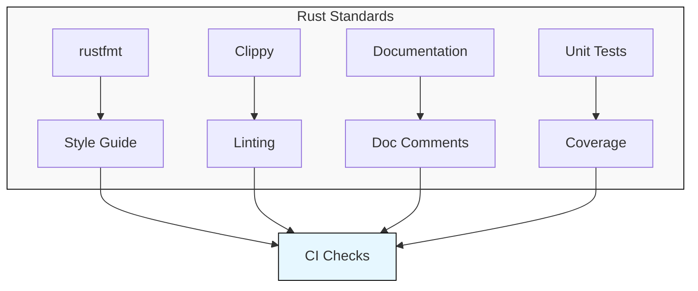
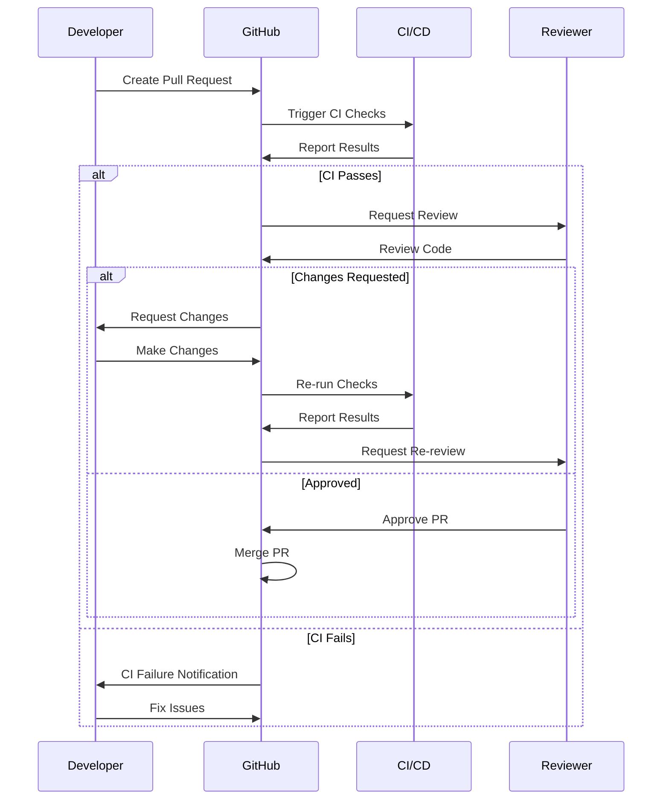
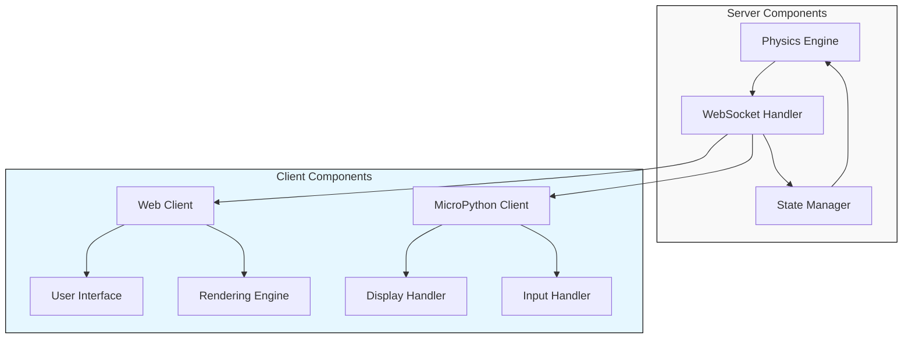

# Contributing to Flight Simulator

Thank you for your interest in contributing to our Flight Simulator project! This document provides guidelines and instructions for contributing to the project.

## Development Workflow


## Getting Started

1. **Fork the repository** on GitHub
2. **Clone your fork** locally:
   ```bash
   git clone https://github.com/your-username/flight-rs.git
   cd flight-rs
   ```
3. **Set up the development environment**:
   ```bash
   # Install Rust dependencies
   cargo build
   
   # Install Python dependencies
   cd python
   poetry install
   cd ..
   ```

## Coding Standards

### Rust Code Standards



- Use `rustfmt` for formatting (run `cargo fmt` before committing)
- Follow Rust's [API Guidelines](https://rust-lang.github.io/api-guidelines/)
- Address all Clippy warnings (run `cargo clippy`)
- Write documentation comments for public API
- Include unit tests for new functionality

### Python Code Standards

- Follow [PEP 8](https://www.python.org/dev/peps/pep-0008/) style guide
- Use type hints wherever possible
- Format code with Black (`black python/`)
- Sort imports with isort (`isort python/`)
- Use docstrings for all functions and classes

### MicroPython Code Standards

- Keep code minimal and efficient due to resource constraints
- Follow PEP 8 style where practical
- Avoid using complex libraries that may not be available on devices
- Test on actual hardware when possible

## Pull Request Process



1. **Create a branch** with a descriptive name:
   ```bash
   git checkout -b feature/add-new-flight-model
   ```

2. **Make your changes** and commit them with clear messages:
   ```bash
   git commit -m "Add realistic wind resistance to flight model"
   ```

3. **Run tests** to ensure your changes don't break anything:
   ```bash
   cargo test
   cd python && python -m pytest
   ```

4. **Push your changes** to your fork:
   ```bash
   git push origin feature/add-new-flight-model
   ```

5. **Create a Pull Request** against the main repository

6. **Address feedback** during code review

## Adding New Features

When proposing new features, please follow this process:

1. **Open an issue** describing the feature first
2. **Discuss the design** with maintainers
3. **Implement the feature** once approved
4. **Add documentation** for the new feature
5. **Add tests** covering the new functionality

## Component Architecture

If you're adding new components, ensure they fit into the existing architecture:



## Testing Guidelines

### Testing Rust Code

- Write unit tests for each module in the same file (`#[test]` inside `src/` files).
- Use integration tests (in the `tests/` directory) for testing API endpoints and overall behavior. These tests interact with the library's public API like an external user.
- Integration tests use snapshot testing (`insta`) to verify complex game states. Run `cargo insta review` to approve or update snapshots after changes.
- Run tests with `cargo test`.

### Testing Python Code

- Use pytest for testing Python code
- Place tests in the `python/tests` directory
- Run tests with `python -m pytest`

### Testing MicroPython Client

- Test basic functionality with the MicroPython REPL
- When possible, test on actual hardware
- Use our test utilities to simulate hardware interactions

## Documentation

Good documentation is essential for this project:

1. **Code Comments**: Explain complex logic in-line
2. **API Documentation**: Document all public interfaces
3. **User Guides**: Update user-facing documentation
4. **Architecture Documentation**: Update diagrams if you change the architecture

## License

By contributing to this project, you agree that your contributions will be licensed under the project's license. 