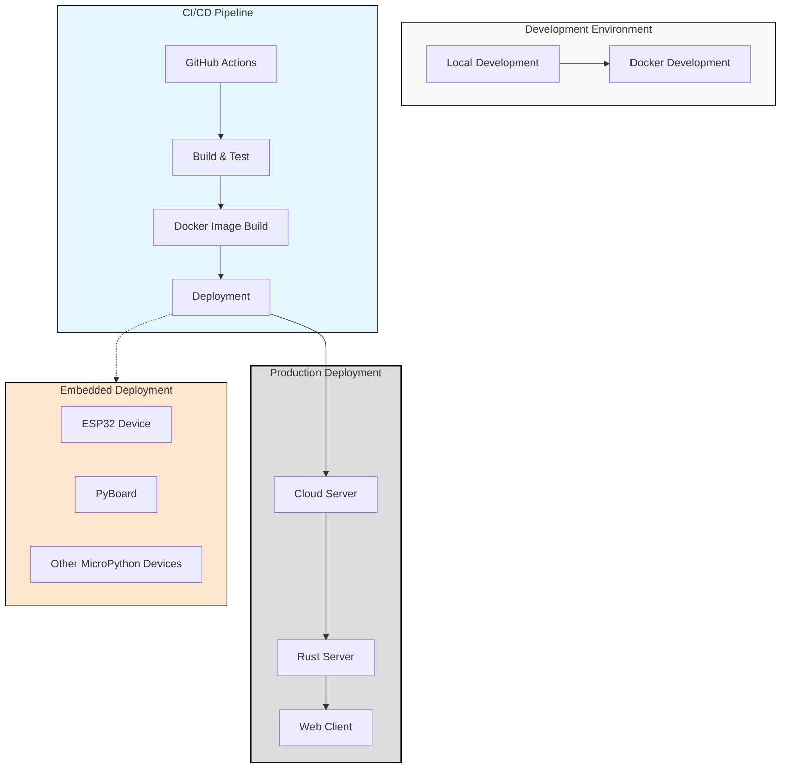
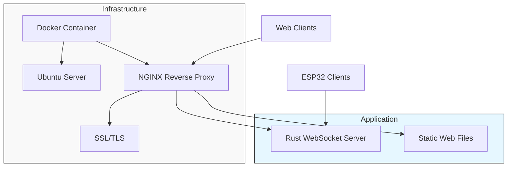
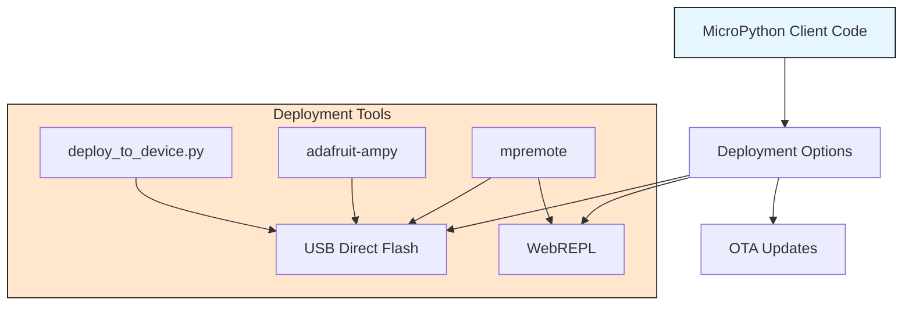
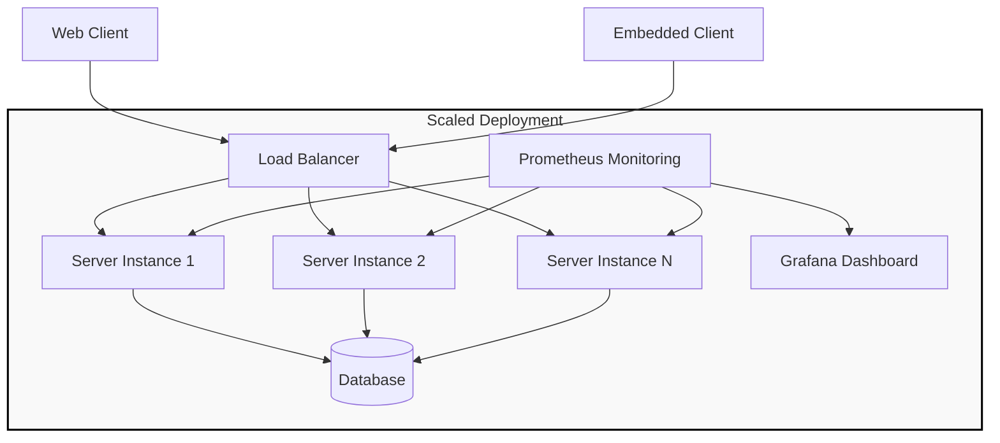

# Deployment Guide

This document provides instructions for deploying the Flight Simulator in various environments, including local development, production servers, and embedded devices.

## Deployment Architecture



## Local Development

### Prerequisites

- [Rust](https://www.rust-lang.org/tools/install) (latest stable)
- [Docker](https://docs.docker.com/get-docker/) and [Docker Compose](https://docs.docker.com/compose/install/)
- [Python 3.10+](https://www.python.org/downloads/) and [Poetry](https://python-poetry.org/docs/)
- [VSCode](https://code.visualstudio.com/) or [Cursor](https://cursor.sh/) (recommended)

### Running the Server Locally

```bash
# Build and run the server
cargo run --bin server

# Run in release mode
cargo run --release --bin server

# Standalone mode (no WebSocket server)
cargo run --bin standalone
```

### Running with Docker

```bash
# Start only the server
docker compose up server

# Start the development environment
docker compose up dev

# Run tests
docker compose up test

# Build all images
docker compose build
```

## Production Deployment

### Server Deployment



### Deployment Steps

1. **Prepare the server**:

```bash
# Install Docker and Docker Compose
sudo apt update
sudo apt install -y docker.io docker-compose
```

2. **Set up NGINX Reverse Proxy**:

```bash
# Install NGINX
sudo apt install -y nginx

# Configure NGINX (example configuration)
sudo nano /etc/nginx/sites-available/flight-simulator
```

Example NGINX configuration:

```nginx
server {
    listen 80;
    server_name your-domain.com;

    location / {
        proxy_pass http://localhost:8080;
        proxy_http_version 1.1;
        proxy_set_header Upgrade $http_upgrade;
        proxy_set_header Connection "upgrade";
        proxy_set_header Host $host;
    }
}
```

3. **Enable the site and restart NGINX**:

```bash
sudo ln -s /etc/nginx/sites-available/flight-simulator /etc/nginx/sites-enabled/
sudo nginx -t
sudo systemctl restart nginx
```

4. **Deploy with Docker**:

```bash
# Clone the repository
git clone https://github.com/yourusername/flight-rs.git
cd flight-rs

# Start the server
docker compose up -d server
```

## Embedded Device Deployment

### MicroPython Deployment Options



### Setting Up an ESP32 Device

1. **Flash MicroPython firmware**:

Download MicroPython firmware for ESP32 from [micropython.org](https://micropython.org/download/esp32/)

```bash
# Install esptool
pip install esptool

# Erase flash
esptool.py --port /dev/ttyUSB0 erase_flash

# Flash firmware
esptool.py --port /dev/ttyUSB0 --baud 460800 write_flash -z 0x1000 esp32-20230426-v1.20.0.bin
```

2. **Deploy the client code**:

```bash
# Using our deployment script
cd flight-rs
python python/scripts/deploy_to_device.py --port /dev/ttyUSB0 --device esp32

# Or using mpremote directly
mpremote connect /dev/ttyUSB0 cp micropython/client.py :client.py
mpremote connect /dev/ttyUSB0 cp -r micropython/lib :lib
```

### Setting Up Network Configuration

Before using the MicroPython client, you need to configure the WiFi settings:

1. Edit `micropython/client.py` to include your WiFi credentials and server address:

```python
# Network configuration
WIFI_SSID = "YourWiFiSSID"  # Change to your WiFi network
WIFI_PASSWORD = "YourWiFiPassword"  # Change to your WiFi password
SERVER_URL = "ws://your-server-address:8080/ws"  # Change to your server address
```

2. Deploy the updated file to the device.

## Scaling the Deployment

For larger deployments, consider:

1. **Load balancing** - Use multiple Rust server instances behind a load balancer
2. **Database integration** - Add persistence for user data and flight records 
3. **Monitoring** - Implement Prometheus and Grafana for real-time monitoring



## Troubleshooting

### Common Issues

1. **Server won't start**:
   - Check if the port is already in use
   - Verify Rust is properly installed
   - Check for missing dependencies

2. **Clients can't connect**:
   - Verify the server is running
   - Check network/firewall settings
   - Ensure correct WebSocket URL

3. **ESP32 connection issues**:
   - Verify WiFi credentials
   - Check server IP address/hostname
   - Verify ESP32 has internet connectivity

## Security Considerations

1. **WebSocket Security**:
   - Use WSS (WebSocket Secure) for production
   - Implement authentication tokens
   - Rate limit connections

2. **Server Hardening**:
   - Keep the Ubuntu server updated
   - Use SSH key authentication
   - Configure a firewall
   - Use Docker security best practices

3. **Embedded Device Security**:
   - Use secure WiFi networks
   - Update MicroPython firmware regularly
   - Don't hardcode sensitive credentials 