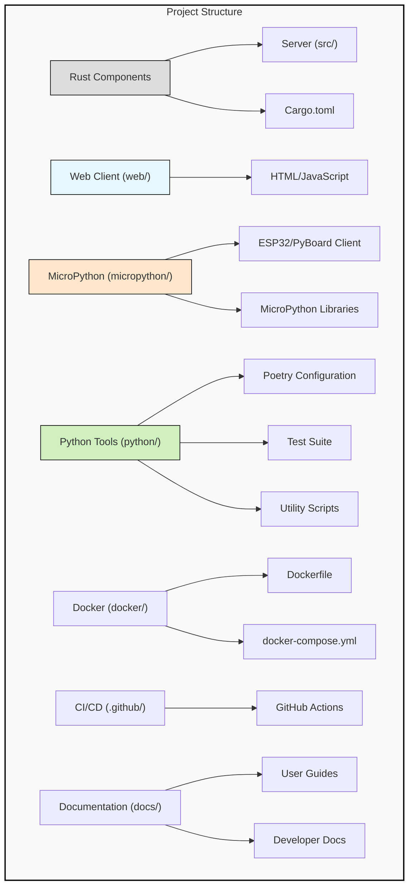
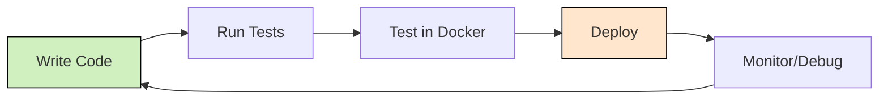

# Project Structure

This document provides an overview of the Flight Simulator project structure and explains the purpose of each component.

## Directory Structure

```
flight-rs/
├── .github/workflows/      # GitHub Actions CI/CD configurations
│   ├── rust.yml            # Rust build and test workflow
│   └── micropython.yml     # MicroPython client testing workflow
│
├── docs/                   # Project documentation
│   ├── CONTRIBUTING.md     # Contributing guidelines
│   ├── DEPLOYMENT.md       # Deployment instructions
│   └── PROJECT_STRUCTURE.md # This file
│
├── src/                    # Rust server source code
│   ├── main.rs             # Standalone simulator entry point
│   ├── server.rs           # WebSocket server entry point
│   └── physics.rs          # Flight physics engine
│
├── web/                    # Web client
│   └── index.html          # Browser client interface
│
├── micropython/            # MicroPython client for embedded devices
│   ├── client.py           # Main client code for ESP32/PyBoard
│   └── lib/                # MicroPython libraries
│       └── ssd1306.py      # OLED display driver
│
├── python/                 # Python development tools
│   ├── pyproject.toml      # Poetry configuration
│   ├── tests/              # pytest test suite
│   │   └── test_server.py  # Server tests
│   └── scripts/            # Development utilities
│       └── deploy_to_device.py # Deployment script for embedded devices
│
├── docker/                 # Containerization for testing
│   └── Dockerfile          # Docker configuration
│
├── .vscode/                # VS Code/Cursor configuration
│   └── settings.json       # Editor settings
│
├── docker-compose.yml      # Docker Compose configuration
├── .rustfmt.toml           # Rust formatting configuration
├── Cargo.toml              # Rust project configuration
├── README.md               # Project overview
└── .gitignore              # Git ignore file
```

## Component Details



### Rust Server Components

#### `src/server.rs`
The WebSocket server that handles client connections, manages game state, and broadcasts updates to all connected clients. It's the core of the multiplayer functionality.

#### `src/physics.rs`
The physics engine that simulates aircraft behavior based on real-world physics principles. It handles force calculations, movement, and collision detection.

#### `src/main.rs`
The standalone mode entry point, which provides a local flight simulator experience without networking.

### Web Client

#### `web/index.html`
A self-contained web client that connects to the server via WebSockets. It includes HTML, CSS, and JavaScript needed to render the flight simulator in a browser.

### MicroPython Client

#### `micropython/client.py`
The main client code for embedded devices (ESP32, PyBoard) that connects to the server and allows controlling an aircraft using physical inputs.

#### `micropython/lib/ssd1306.py`
A driver for SSD1306 OLED displays, enabling graphical output on embedded devices.

### Python Development Tools

#### `python/pyproject.toml`
Poetry configuration for managing Python dependencies and development environment.

#### `python/tests/`
Test suite for verifying server functionality and client-server communication.

#### `python/scripts/deploy_to_device.py`
Utility script for deploying MicroPython code to embedded devices.

### Docker Configuration

#### `docker/Dockerfile`
Docker configuration for creating containerized environments for development and testing.

#### `docker-compose.yml`
Defines services for development, testing, and production deployment.

### GitHub Actions

#### `.github/workflows/rust.yml`
CI/CD workflow for building and testing the Rust server components.

#### `.github/workflows/micropython.yml`
CI/CD workflow for linting and testing the MicroPython client.

### Documentation

#### `docs/CONTRIBUTING.md`
Guidelines for contributing to the project, including coding standards and pull request process.

#### `docs/DEPLOYMENT.md`
Instructions for deploying the simulator in various environments.

#### `docs/PROJECT_STRUCTURE.md`
This file, explaining the project structure and components.

## Code Organization Principles

The project follows these organizational principles:

1. **Separation of Concerns**: Each component focuses on a specific responsibility
2. **Modular Design**: Components are designed to be swappable and independently testable
3. **Cross-Platform Compatibility**: Code is structured to work across different platforms
4. **Developer Experience**: Tools and configurations enhance the development workflow

## Development Workflow



The typical development workflow involves:

1. Developing code in your preferred editor (VS Code/Cursor recommended)
2. Running local tests via `cargo test` and `pytest`
3. Testing in Docker with `docker compose up test`
4. Deploying to target environments
5. Monitoring and debugging

## File Naming Conventions

- Rust files: Snake case (`server.rs`, `physics.rs`)
- Python files: Snake case (`deploy_to_device.py`, `test_server.py`)
- Documentation: Uppercase with underscores (`CONTRIBUTING.md`, `PROJECT_STRUCTURE.md`)
- Configuration: Lowercase with dots (`.rustfmt.toml`, `pyproject.toml`) 